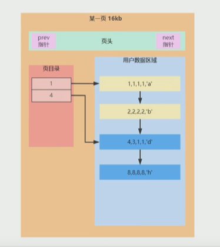
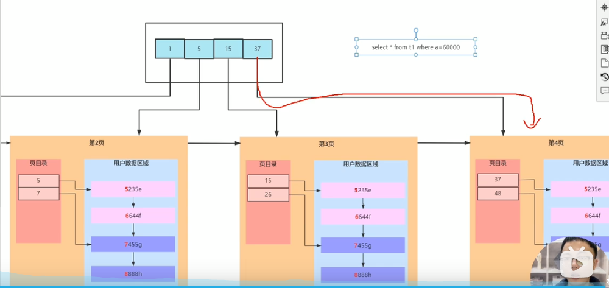
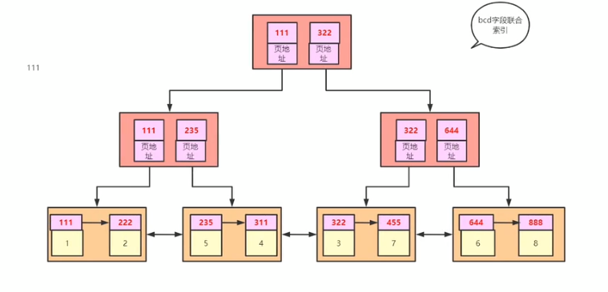
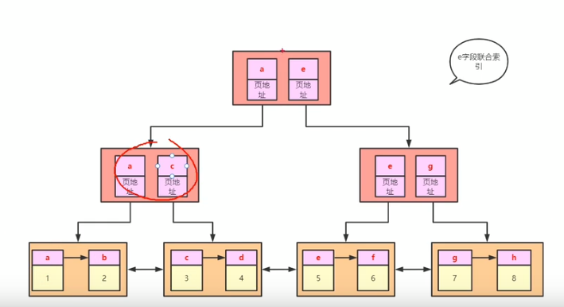
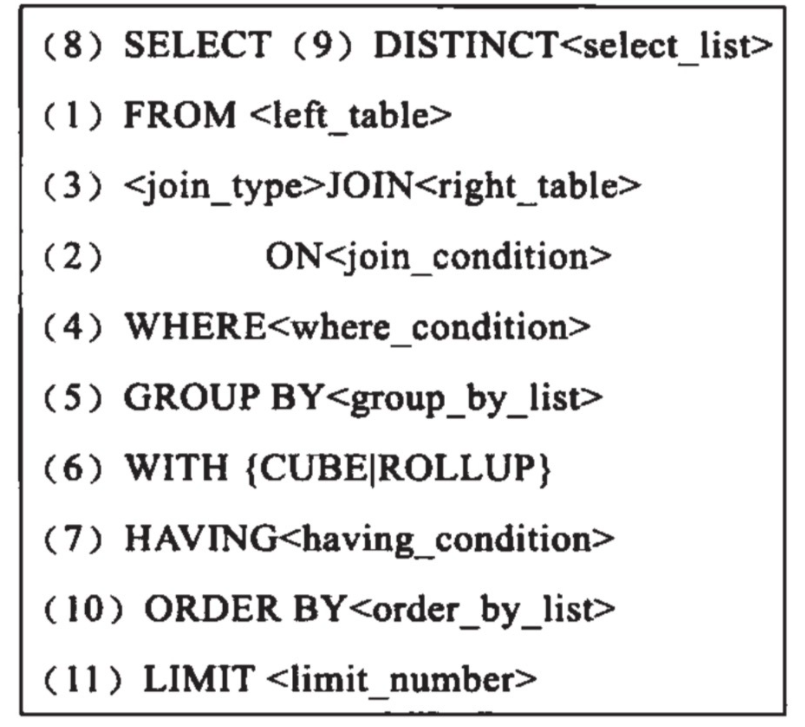

# MYSQL
### B+树特点
- 节点里可以有多个元素
- 排了序
- 叶子节点之间有双向指针
- 非叶子节点上的数据都冗余了一份在叶子节点上
- 非叶子结点的子结点数不会超过它的阶数

### Innodb

- Innodb_page_size = 16kb
    页头(存有前后两个指针)
    页目录(存放索引信息)
    用户数据区域(存放一行行数据)

- 插入的时候排过序
- 建议用自增ID，插入时对链表的处理少一点，不会去找需要插入的位置，再断开链表
自增ID直接在尾部拼接就行了，也不会在新增一页的时候还去修改原本已经存满的页的数据
    
- 提高遍历列表(用户数据区域内)效率的措施：页目录(空间换时间) 每个目录里存的是索引的信息
- 三层的B+树，按每行数据1kb，主键是自增的int来算，一个int4个字节，一个指针6字节，一个非
叶子节点可以存1638条信息，两层可以存 1638 * (16KB / 1KB)条，三层可以存再乘上1638条的数据
#### 范围查找
    InnoDB 范围查找怎么实现走索引的，比如索引字段 A > 6 先找 A=6的，后面的就是满足条件的
#### 为什么要遵守最左前缀原则才能利用到索引

    叶子节点里存了索引字段的信息，还存了主键信息，当 select * from t1 where b = 1 and c = 1 and d = 1
时在联合索引的B+树内找到了特定的叶子节点，再根据其中存的主键去主键索引的B+树去找全部的信息，称之为Innodb的
_**回表**_   
 - 最左前缀原则和where 后面的条件顺序是没有关系的，索引最左边的字段是b，如果where后没有 b = ？ 条件就不符合
 最左前缀原则，用不了bcd索引 
    - *11 和 222、333两个数据没有办法比较大小 
    - 1*1 用到索引只有 b字段
    
#### 范围查找导致索引失效
    explain select * from t1 where  b > 1  如果 是 b > 5 就会走索引，因为 > 1的数据比较多，又是 select *
    如果走索引，需要回表多次，不如直接全表扫描快，所以范围条件尽量写精确
    或者覆盖索引，select b，即查询的字段是正在利用的索引字段内，加一个主键也是
    复合覆盖索引的
#### 索引扫描底层原理
    explain select c from t1  没有加where 条件，也不符合最左前缀原则，但还是走了索引，
    1.c字段是出于bcd索引字段范围内，在这个索引的B+树叶子节点可以找到c的信息，而主键索引
    B+树叶子节点存了所有字段的信息，一页16KB，主键B+树能存的信息是少于bcd B+树的，所以走
    bcdB+树找
    2.至于不符合最左前缀原则，这里是直接在叶子节点上遍历取c字段的值，而不是判断非叶子结点
    存的索引与传入的 where 条件后的c哪个大
#### order by 导致索引失效
    explain select * from t1 order by b,c,d
    1.走bcd索引，不需要排序 + 回8次表
    2.全表扫描 额外排序(内存中) + 不用回表
    

#### mySql中数据类型转换
    除了数字的字符 如 '123' 会转换为 123 外，其他的字符都会转换成0
    select * where a = 'c'  因为a 是int类型， 'c'会转换为 0 再查询，如果表中有a = 0的
    数据就会查询出来
    只要对字段进行了操作，就用不了索引
    explain select * from t1 where e = 0;这里会将e字段转换为数字，查出来8条
    为什么不走索引，走索引就需要把索引上存的字符也变为数字，字符本身是排好序的，
    转为数字之后，B+树很可能会无序
    explain select * from t1 where a+1 = 1; 也会导致全表扫描

